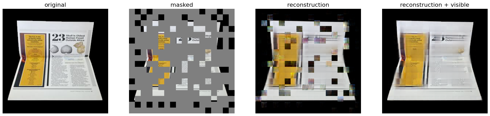

# DocMAE

Unofficial implementation of **DocMAE: Document Image Rectification via Self-supervised Representation Learning**

https://arxiv.org/abs/2304.10341

## TODO

- [x] Document background segmentation network using U2 net
- [x] Synthetic data generation for self-supervised pre-training
- [x] Pre-training
- [ ] Fine-tuning for document rectification (In progress)
- [ ] Evaluation
- [ ] Code clean up and documentation
- [ ] Model release

## Demo

Find a jupyter notebook at [demo/background_segmentation.ipynb](demo/background_segmentation.ipynb)

## Data

### Pre-training

- 3411482 pages from ~1M documents from Docile dataset (https://github.com/rossumai/docile)
- Rendered with Doc3D https://github.com/Dawars/doc3D-renderer
- 558 HDR env lighting from https://hdri-haven.com/

Pretraining on 200k documents:

#### Run training via:
`python pretrain.py -c config/config.json`
Visualize trained model using https://github.com/NielsRogge/Transformers-Tutorials/blob/master/ViTMAE/ViT_MAE_visualization_demo.ipynb

# Acknowledgement

Test documents come from DIR300 dataset https://github.com/fh2019ustc/DocGeoNet